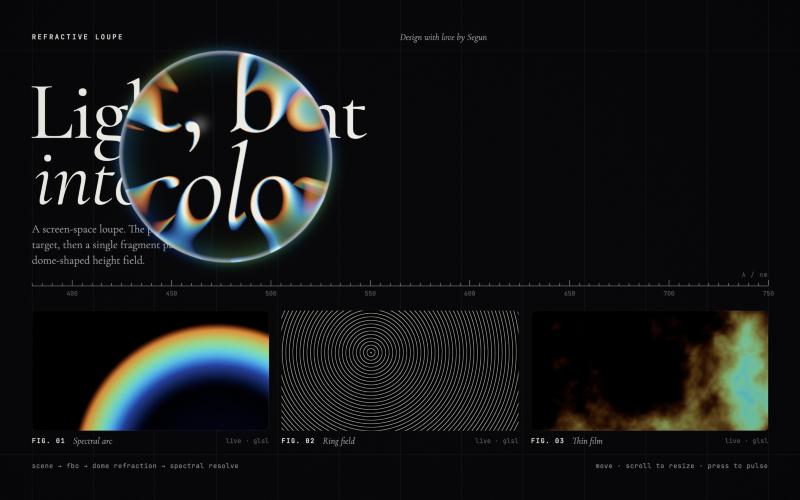

<p align="center">
  
</p>

<h1 align="center">Chromatic Lens</h1>

<p align="center">
  A refractive WebGL loupe with thin-film chromatic dispersion —<br>
  for images, Three.js scenes and <strong>live DOM</strong>.
</p>

<p align="center">
  <a href="https://www.npmjs.com/package/chromatic-lens"></a>
  <a href="https://bundlephobia.com/package/chromatic-lens"></a>
  
  <a href="./LICENSE"></a>
</p>

<p align="center">
  <a href="#install">Install</a> ·
  <a href="#quick-start">Quick start</a> ·
  <a href="#options">Options</a> ·
  <a href="#methods">Methods</a> ·
  <a href="#recipes">Recipes</a> ·
  <a href="#examples">Examples</a>
</p>

---

The page is rendered to an off-screen target, then one fragment pass bends it through a dome-shaped height field. Every spectral sample refracts with its own index of refraction, so the rim resolves white light into a thin-film spectrum — amber, gold, emerald, cyan, electric blue — the way a soap bubble does.

- **Physically-motivated optics** — dome height field → surface normal → `refract()` per wavelength, with per-channel normalisation so white stays white.
- **Thin-film palette** — a cosine interference palette for dispersion weights, rim iridescence and halo.
- **Glossy surface** — Fresnel rim (exponent 3.5, outer 5%), specular hotspot, soft outer glow.
- **Spring physics** — lerped position spring, velocity *pinch* into an oriented ellipse, and a subtle *jiggle* when the pointer stops.
- **Three sources** — any image / video / canvas / URL, your own Three.js scene, or a **live DOM element** captured through SVG `foreignObject` (the real DOM stays clickable).
- **Touch-first** — drag to steer, with a configurable `touchOffset` so the finger never covers the lens.
- **Well-behaved** — `ResizeObserver`, pauses off-screen, `prefers-reduced-motion`, DPR cap, full `destroy()`.

## Install

```bash
npm install chromatic-lens three
```

Three.js is a peer dependency (`>= 0.160`). TypeScript declarations are included.

**CDN — script tag** (Three.js bundled in, exposes `window.ChromaticLens`):

```html
<script src="https://cdn.jsdelivr.net/npm/chromatic-lens@0.1/dist/chromatic-lens.min.js"></script>
```

**CDN — ES modules** (share Three.js with the rest of your page):

```html
<script type="importmap">
  {
    "imports": {
      "three": "https://cdn.jsdelivr.net/npm/three@0.186.1/build/three.module.js",
      "chromatic-lens": "https://cdn.jsdelivr.net/npm/chromatic-lens@0.1/dist/chromatic-lens.mjs"
    }
  }
</script>
```

## Quick start

### Refract live HTML

```js
import { ChromaticLens } from 'chromatic-lens';

const hero = document.querySelector('.hero');

const lens = new ChromaticLens({
  targetElement: hero,   // the canvas mounts here and sizes to it
  element: hero,         // what to capture — the target itself or any descendant
  radius: 160,
  dispersion: 0.4,
});
```

The element is rasterised (styles, images and webfonts inlined) and re-captured whenever it mutates, resizes or loads fonts. In this *overlay* mode the canvas is transparent outside the lens and ignores pointer events, so text stays selectable and links keep working.

### Refract an image, video or canvas

```js
new ChromaticLens({
  targetElement: document.getElementById('stage'),
  texture: '/images/plate.jpg',   // URL, , <video>, <canvas>, ImageBitmap or THREE.Texture
  fit: 'cover',
});
```

### Refract a Three.js scene

```js
import * as THREE from 'three';
import { ChromaticLens } from 'chromatic-lens';

const scene = new THREE.Scene();
const camera = new THREE.PerspectiveCamera(40, 1, 0.1, 100);
camera.position.z = 5;
scene.add(new THREE.Mesh(new THREE.TorusKnotGeometry(1, 0.32, 200, 32), new THREE.MeshNormalMaterial()));

new ChromaticLens({
  targetElement: document.getElementById('stage'),
  scene,
  camera,
  onResize: ({ width, height }) => { camera.aspect = width / height; camera.updateProjectionMatrix(); },
  onFrame: (time) => { scene.rotation.y = time * 0.3; },
});
```

The scene is rendered into the lens' FBO every frame. Built-in materials work as-is; custom `ShaderMaterial`s should end their fragment shader with `#include <colorspace_fragment>` on its own line (the content pass is linear, half-float).

### Script tag

```html
<div id="stage" style="position: fixed; inset: 0"></div>
<script src="https://cdn.jsdelivr.net/npm/chromatic-lens@0.1/dist/chromatic-lens.min.js"></script>
<script>
  const lens = new ChromaticLens({ targetElement: document.getElementById('stage'), texture: 'plate.jpg' });
</script>
```

## Options

Everything except `targetElement` is optional. Every parameter can be changed later with `lens.set({ … })`.

### Source

| Option | Type | Default | Description |
| --- | --- | --- | --- |
| `targetElement` | `HTMLElement` | — | **Required.** The canvas mounts inside and sizes to it. Pointer input is read from it. |
| `element` | `HTMLElement` | — | Refract a live DOM element (same as `bindToElement()`). |
| `capture` | `CaptureOptions` | `{}` | Options for `element` — see [`bindToElement`](#methods). |
| `texture` | `TextureSource` | — | URL, ``, `<video>`, `<canvas>`, `ImageBitmap` or `THREE.Texture`. |
| `fit` | `'cover' \| 'fill'` | `'cover'` | How `texture` maps onto the target. |
| `scene`, `camera` | `THREE.Scene`, `THREE.Camera` | — | Refract your own scene (pass both). |

### Lens

| Option | Default | Description |
| --- | --- | --- |
| `radius` | `170` | Lens radius in CSS px. Spring-animated when changed. |
| `refraction` | `0.85` | How far the refracted ray travels before it meets the page — overall bend strength. |
| `ior` | `1.42` | Base index of refraction. |
| `profile` | `0.5` | Dome exponent *k* in `z = (1 − r²)^k`. `0.5` is a sphere cap, lower is a hard bubble rim, `> 1` a soft pillow. |

### Dispersion

| Option | Default | Description |
| --- | --- | --- |
| `dispersion` | `0.4` | IOR spread between the amber and electric-blue ends of the spectrum. `0` disables colour fringing. |
| `falloff` | `2` | Concentrates dispersion towards the rim. `0` leaves only the physical falloff. |
| `samples` | `16` | Spectral samples per lens pixel (1–32). Lower is faster; `3` gives a classic RGB split. |
| `contrast` | `2` | Sharpens the thin-film palette weights for more saturated fringes. |

### Surface

| Option | Default | Description |
| --- | --- | --- |
| `edgeGlow` | `0.7` | Thin-film iridescence on the rim and the soft outer halo. |
| `film` | `1.1` | Film thickness — selects which interference band shows on the rim. |
| `fresnel` | `0.55` | Glossy Fresnel highlight on the outer 5% of the rim. |
| `highlight` | `0.3` | Specular hotspot. |

### Physics

| Option | Default | Description |
| --- | --- | --- |
| `stiffness` | `180` | Position spring stiffness. |
| `damping` | `17` | Position spring damping. Below `2·√stiffness` it overshoots slightly. |
| `pinch` | `0.6` | How much velocity stretches the lens into an ellipse along its direction of travel. |
| `jiggle` | `0.65` | Spring-back wobble when the pointer stops. `0` settles cleanly. |

### Input & behaviour

| Option | Default | Description |
| --- | --- | --- |
| `touchOffset` | `{ x: 0, y: -60 }` | Added to touch positions (CSS px) so the finger doesn't hide the lens. `null` to disable. |
| `touchAction` | `'none'` | CSS `touch-action` on the target. Use `'pan-y'` to keep vertical page scrolling. |
| `wheelResize` | `false` | Mouse wheel over the target resizes the lens (and blocks page scroll there). |
| `idleDrift` | `true` | Slow Lissajous drift until the pointer arrives, and after it leaves the window. |
| `cursor` | `true` | Hide the system cursor over the target and draw an exact pointer dot. |
| `maxDpr` | `2` | Device-pixel-ratio cap. |
| `background` | `0x09090b` | Clear colour (and DOM-capture fallback background). |
| `vignette` | `0.28` | Screen vignette (not applied in overlay mode). |
| `grain` | `0.022` | Film grain. |

### Callbacks

| Option | Signature | Description |
| --- | --- | --- |
| `onResize` | `({ width, height, pixelRatio, bufferWidth, bufferHeight }) => void` | After every resize — relayout your scene here. |
| `onFrame` | `(time, dt) => void` | Before every frame — animate your scene here. |
| `onParamsChange` | `(changed) => void` | When the lens changes a parameter itself (e.g. wheel-resize) — sync your UI. |
| `onCapture` | `(canvas) => void` | After each DOM capture, with the rasterised canvas. |

## Methods

| Method | Description |
| --- | --- |
| `set(params)` | Merge parameter updates. Chainable. |
| `bindToElement(element = targetElement, options?)` | Capture a DOM element into the backing texture. Options: `live` (`true`) re-capture on mutation/resize/font load · `embedFonts` (`true`) · `overlay` (`true`) transparent outside the lens · `debounce` (`150` ms). |
| `unbindElement()` | Stop live capture and return to opaque rendering. |
| `refresh()` | Re-capture the bound element now. Returns a `Promise`. |
| `setTexture(source, { fit })` | Switch to an image / video / canvas / URL / texture source. |
| `setScene(scene, camera)` | Switch to a Three.js scene source. |
| `resize()` | Re-measure the target. Runs automatically via `ResizeObserver`. |
| `destroy()` | Stop the loop, remove listeners and the canvas, restore the target's styles, free GPU memory. |
| `ChromaticLens.isSupported()` | `true` when WebGL2 is available. |
| `ChromaticLens.DEFAULTS` | The default parameters. |

Also exported: `LENS_DEFAULTS`, `THIN_FILM_GLSL` (the palette as a GLSL snippet, to colour-match your own shaders) and `rasterizeElement(element, options)` (the DOM → canvas capture on its own).

## Recipes

**Reading loupe** — calm magnifier, barely any colour:

```js
lens.set({ refraction: 0.6, dispersion: 0.12, falloff: 4, edgeGlow: 0.2, fresnel: 0.3, highlight: 0.1, pinch: 0.2, jiggle: 0 });
```

**Soap bubble** — hard rim, vivid film, wobbly:

```js
lens.set({ profile: 0.3, refraction: 1.1, dispersion: 0.9, contrast: 3, edgeGlow: 1.4, film: 1.8, jiggle: 0.9 });
```

**Glass prism** — strong, sharp spectral split all the way in:

```js
lens.set({ ior: 1.7, dispersion: 1.2, falloff: 0.5, samples: 24, contrast: 3.5 });
```

**Mobile-friendly** — fewer samples, lower DPR, page still scrolls vertically:

```js
const coarse = matchMedia('(pointer: coarse)').matches;
new ChromaticLens({
  targetElement: hero,
  element: hero,
  samples: coarse ? 8 : 16,
  maxDpr: coarse ? 1.5 : 2,
  touchAction: 'pan-y',
  touchOffset: { x: 0, y: -72 },
});
```

**React**:

```jsx
function Loupe({ children }) {
  const ref = useRef(null);
  useEffect(() => {
    const lens = new ChromaticLens({ targetElement: ref.current, element: ref.current });
    return () => lens.destroy();
  }, []);
  return <section ref={ref}>{children}</section>;
}
```

## Touch & mobile

Touch-and-drag steers the lens. `touchOffset` shifts it away from the fingertip (above it by default). Extra fingers are ignored, and lifting the finger leaves the lens where it was. The default `touchAction: 'none'` stops the browser from scrolling while you drag. On sections inside a scrolling page, use `'pan-y'`: vertical swipes then scroll the page and horizontal drags move the lens.

## DOM capture: what to know

`bindToElement` clones the element with every computed style inlined, embeds ``s and webfonts as data URLs, and draws it through an SVG `foreignObject`.

- **Webfonts** are embedded from stylesheets that are same-origin or served with CORS (Google Fonts works). Only faces covering basic Latin are embedded.
- **Images** must be same-origin or CORS-enabled. Others are left blank.
- **Not captured:** `::before` / `::after` content, CSS `background-image` URLs, iframes, closed shadow roots.
- The bound element must be the `targetElement` or one of its descendants.
- Capture is asynchronous and debounced. The lens appears once the first capture is ready.

## Performance

The lens pass costs about `samples` texture reads per pixel, and only inside the lens. Outside it, the pass is a single read. Rendering pauses while the target is off-screen. If a mid-range phone struggles, lower `samples` and `maxDpr` first.

## Accessibility

- The canvas is `aria-hidden`. Keep real content in the DOM; DOM capture mode does this by design.
- With `prefers-reduced-motion`, the idle drift and the velocity pinch are disabled.
- Nothing flashes.

## Browser support

Requires WebGL2: current Chrome, Edge, Firefox and Safari 15+. Check `ChromaticLens.isSupported()` and fall back to static content.

## Examples

```bash
npm install
npm run build
npm run serve      # http://localhost:3000
```

| Page | Shows |
| --- | --- |
| [`/index.html`](./index.html) | Editorial canvas scene, Leva controls, every parameter live |
| [`/examples/dom.html`](./examples/dom.html) | Live DOM capture in overlay mode, with clickable buttons |
| [`/examples/cdn.html`](./examples/cdn.html) | The script-tag build with a canvas texture |

The pages use ES modules, so open them through the local server, not as `file://` paths.

## Development

| Script | Does |
| --- | --- |
| `npm run build` | `tsup` → `dist/chromatic-lens.mjs` (ESM), `.cjs` (CommonJS), `.min.js` (IIFE, Three.js bundled) |
| `npm run dev` | Rebuild on change |
| `npm run typecheck` | Check `types/index.d.ts` |
| `npm run serve` | Static server for the demo and examples |

## License

[MIT](./LICENSE) © Olusegun Aribido — *Design with love by Segun.*
